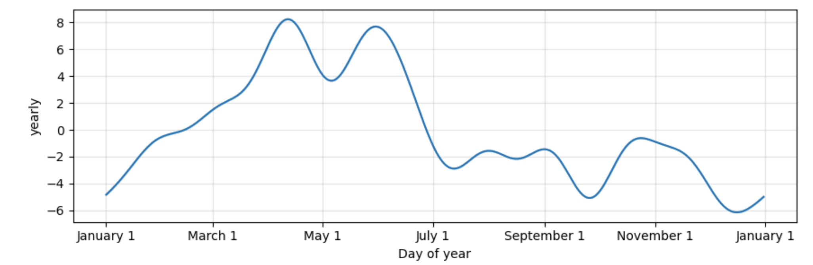

## Energy Sector ETF Prediction and Risk Analysis

# Summary

The Energy Options Hedging application is a comprehensive tool designed to help users navigate the complexities of the energy market. It leverages historical data on key components such as Crude Oil, Natural Gas, Coal, and the Currencies of Energy-importing countries, all with prices converted to USD. The application focuses on the Energy Sector ETF as the target variable and uses the other components as features for training its machine-learning models.

By analyzing historical data, the application trains machine-learning models such as linear regression, random forest, and neural network to predict the behavior and movement of the Energy Sector ETF in the future. Users can choose from these models to make predictions, providing them with insights to better understand and anticipate fluctuations in the market.

But the application doesn't stop there. After making predictions, it employs risk analysis techniques to further assist users in making informed decisions. The Black-Scholes model, a widely used method for pricing options contracts, is utilized to consider factors such as the current stock price, the option's strike price, time to expiration, risk-free interest rate, and the volatility of the underlying asset.

Additionally, the application utilizes the Expected Monetary Value (EMV) formula to calculate the average outcome of different scenarios weighted by their probabilities. This analysis helps users assess the risk involved in various hedging options and provides recommendations for the best course of action to mitigate that risk.

By integrating predictive models with risk analysis techniques, the Energy Options Hedging application offers users comprehensive insights into optimal hedging strategies tailored to their specific positions and market conditions. This approach ensures that users can make well-informed decisions to manage and mitigate risks effectively in the dynamic energy market landscape.

## Linear Regression

## Random Forest

## Neural Network

## Average of all Models

## Average of all Models

## Prophet Seasonality

## Team
Jarom Lemmon
Kerim Muhammetgylyjov
Jacquelin Chavez

## Sources
[The Black-Scholes Formula](https://www.timworrall.com/fin-40008/bscholes.pdf)
[Quantitative Risk Analysis](https://projectmanagers.net/quantitative-risk-analysis-pmp-overview/)
[Neural Network for Option Pricing ](https://www.youtube.com/watch?v=r6KTnKim_BA)
